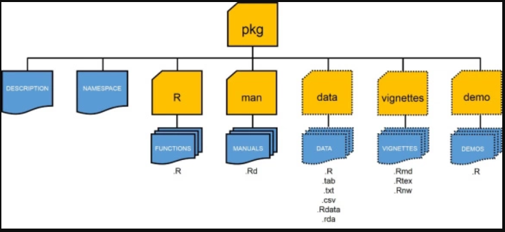

<style type="text/css">
.main-container {
  max-width: 800px;
  margin-left: 200px;
  margin-right: auto;
}

  }
td {  /* Table  */
  font-size: 8px;
  
}
h1.title {
  font-size: 38px;
  color: DarkRed;
}
h1 { /* Header 1 */
  font-size: 30px;
  color: DarkBlue;
}
h2 { /* Header 2 */
    font-size: 25px;
  color: DarkBlue;
}
h3 { /* Header 3 */
  background: #cce5ff;
  font-size: 20px;
  font-family: "Times New Roman", Times, serif;
  color: DarkBlue;
}
code.r{ /* Code block */
    font-size: 12px;
}
pre { /* Code block - determines code spacing between lines */
    font-size: 14px;
}

ol { /* ordered list style */
    font-size: 20px;font-weight:bold;}

ul {/* dot list style */
font-size: 15px;}


</style>


####Package structure


## Package development 
### One way of developing R packages is using the devtools, and usethis package [https://cran.r-project.org/web/packages/usethis/usethis.pdf](https://cran.r-project.org/web/packages/usethis/usethis.pdf). R folder, man folder, DESCRIPTION file and NAMESPACE file are the minimum required content to build a package. 
0. create a project in a package-name new folder in Rstudio

1. under the rstudio project, create a r file that will bag functions for your packages
```{r eval=F }
  usethis::use_r('RfileName')
```

2. automate documentation after [insert roxygen skeleton](pics/Roxygen.PNG) into each function (code->Insert Roxygen Skeleton in rstudio IDE or Ctrl + shift + Alt + R on keyboard)
```{r eval=F}
devtools::document()
```

3. If your package includes small dataset, use use_data() to save existing data from the memory (called df, for example) into a data directory (It will create a directory if not available yet)
```{r eval=F}
devtools::use_data(df,overwrite = TRUE)
```
 

4. If you need to write R-script to generate your data for your package, your Rscript should be save in data_raw folder. Documentation for internal data detail skipped here
```{r eval=F}
devtools::use_data_raw()
```

5. create a rmarkdown file for automate md file for github (if you use github as your package repository)
```{r eval=F}
devtools::use_readme_rmd()
```

6. refresh all (r) files in the package before testing all functions within the package
```{r eval=F}
devtools::load_all('.')
```

7. install the package from the source (package could be saved in github as well)
```{r eval=F}
devtools::install("your local directory/PackageName") or 
devtools::install_github("your github user name/PackageName")
```

